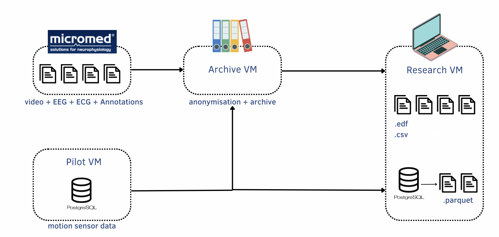

The detect-teppe data are stored in La Teppe facilities and are accessible through vpn.
The data is anonimised and cannot leave the La Teppe servers in any circumpstances.

To access them you need to :

1.  Contact [infra@aura.healthcare](mailto:infra@aura.healthcare) to get the data access chart
2.  Sign the data access chart
3.  Ask for vpn credentials to [infra@aura.healthcare](mailto:infra@aura.healthcare).
4.  Download [Forticlient VPN](https://www.fortinet.com/fr/support/product-downloads)
5.  Ask access to [installation documentation](https://drive.google.com/file/d/1GW3RDDJ9g-unu0kB6I7VhABr8Jy9u3Vr/view?usp=sharing)

