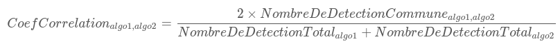
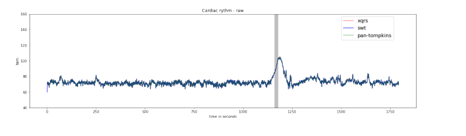

# Machine Learning Applied to Epileptic Seizure Detection 🧠💡

The Aura association is leading an open and collaborative initiative to develop a connected patch to detect epileptic seizures.

To design this detection system, we're studying a relevant biomarker: The [ECG - Electrocardiogram](https://en.wikipedia.org/wiki/Electrocardiography) signal.

## An Open Database 📊

We're building our seizure detection model using an open database: **TUH Seizure Corpus (TUSZ) v1.5.1**.

This **67GB** database records the electrophysiological activities ([electroencephalogram](https://en.wikipedia.org/wiki/Electroencephalography), electrocardiogram) of **692 patients** during **5610 examinations** for a total duration of **1074 hours**.

A team of neurologists reviewed these recordings and annotated nearly **3500 epileptic seizures**. We'll train our model based on this binary annotation (background or seizure).

!!! note
    Seizure time represents only **7% of the total recording time**. We'll need to account for this class imbalance (background/crisis) when training the crisis detection algorithm.

For more information about this database and the research team behind it, [click here](https://www.isip.piconepress.com/projects/tuh_eeg/).

### Database Structure

The original database is structured as follows:

```
─ dev                                               // Dataset split into dev/testing/validation
│   ├── 01_tcp_ar                                   // Montage type used for EEG recording
│   │   ├── 002
│   │   │   └── 00000258                            // Patient folder
│   │   │       ├── s002_2003_07_21                 // Recording Session folder
│   │   │       │   ├── 00000258_s002_t000.json     // A single EEG/ECG recording
│   │   │       │   └── 00000258_s002_t002.json
│   │   │       └── s003_2003_07_22
│   │   │           ├── 00000258_s003_t000.json
│   │   │           ├── 00000258_s003_t001.json
│   │   │           ├── 00000258_s003_t002.json
│   │   │           ├── 00000258_s003_t003.json
 ...                ...
```

## Preprocessing the Heart Signal ❤️

We've performed initial processing on this large, complex volume of data, focusing solely on the ECG signal.

### ECG Signal

Electrocardiography (ECG) graphically represents the heart's electrical activity. In our case, it's measured using 2 electrodes placed on the left and right of the torso (V1 and V2 in the diagram below):


*ECG electrodes. Source: American Heart Association*

Here's an example of a standard ECG record:


*ECG standard. Source: https://ya-webdesign.com*

!!! warning
    In real-life conditions, this signal is often noisy due to muscle movement artifacts or electrode contact issues, complicating analysis.

Examples of noisy ECG signals:


*ECG low noise*


*ECG mid noise*


*ECG high noise*

### R-R Intervals

Epileptic seizures can lead to disturbances in the [autonomous nervous system](https://en.wikipedia.org/wiki/Autonomic_nervous_system), resulting in heart rhythm disorders (tachycardia, bradycardia, etc.).

These disorders are studied through R-R interval analysis. **An R-R interval represents the duration of one heartbeat**, corresponding to the time between 2 R peaks of the ECG signal:


*R-R interval. Source: https://ya-webdesign.com*

There's a direct link between heart rate and R-R interval:


### Extracting R-R Intervals from ECG Signal

We use standard "QRS complex detection" algorithms to extract R-R intervals from the ECG signal. We've chosen three robust implementations:

- Pan Tompkins
- Stationary Wavelet (swt)
- XQRS

We compare these methods using two metrics:

1. Correlation coefficient:
   
   (0 = totally different results, 1 = perfect correlation)

2. Missing beats:
   
   (Lower is better)

### Available Data

R-R interval data and robustness metrics are stored in JSON files in the **res-v0_4** folder. Here's the format:

```json
{
  "infos": {
    "sampling_freq": 400,
    "start_datetime": "2003-07-21T17:12:54",
    "exam_duration": 20,
    "ref_file": "00000258_s002_t000.edf"
  },
  "pan-tompkins": {
    "qrs": [...],
    "rr_intervals": [652.5, ..., 800],
    "hr": [91.0, ...]
  },
  "swt": {...},
  "xqrs": {...},
  "score": {
    "corrcoefs": [[1, 0.3287671232876712, 0.40540540540540543],
                  [0.3287671232876712, 1, 0.8524590163934426],
                  [0.40540540540540543, 0.8524590163934426, 1]],
    "matching_frames": [[43, 12, 15], [12, 30, 26], [15, 26, 31]],
    "missing_beats_duration": [[0, 0.0, 0.0],
                               [0.0, 0, 0.0],
                               [0.0, 0.0, 0]]
  }
}
```

Example heart rate representation:


*Heart rate displayed for a 30-minute exam*

## Database Annotations 🏷️

The database includes binary annotations:
- background
- seizure

Annotations are formatted as intervals with start and end times relative to the examination start.

### Available Annotation Data

Annotation data is stored in JSON files in the **annot-v0_4** folder. Format:

```json
{
  "background": [[0.0, 80.5], [121.0, 185.0]],
  "seizure": [80.5, 121.0]
}
```

## Calculating Relevant Medical Indicators (Features) 📊

We extract business features from R-R intervals based on three categories:
- Time domain indicators
- Frequency domain indicators
- Non-linear indicators

We divide each examination into **10-second intervals** and calculate 28 indicators with associated labels.

!!! info
    - Time domain indicators: 10-second sliding window
    - Frequency domain indicators: 2min30 (150 seconds) sliding window
    - Non-linear indicators: 1min30 sliding window


*Computation windows for different indicators*

**Indicators list:**

```json
FEATURES_KEY_TO_INDEX = {
    'interval_index': 0,
    'interval_start_time': 1,
    'mean_nni': 2,
    // ... (other indicators)
    'label': 29
}
```

For detailed information on these indicators, [click here](https://github.com/Aura-healthcare/hrvanalysis).

### Available Feature Data

Feature data is stored in JSON files in the **feats-v0_4** folder, with one file per R-R interval calculation method. Format:

```json
{
  "keys": ["interval_index", "interval_start_time", "mean_nni", ...],
  "features": [
    [0.0, 0.0, 595.859375, ...],
    [1.0, 10000.0, NaN, ...],
    ...
  ]
}
```

## The Seizure Detection System 🚀

**It's your turn now!** Use this preprocessed data to build and train your seizure detection model.
